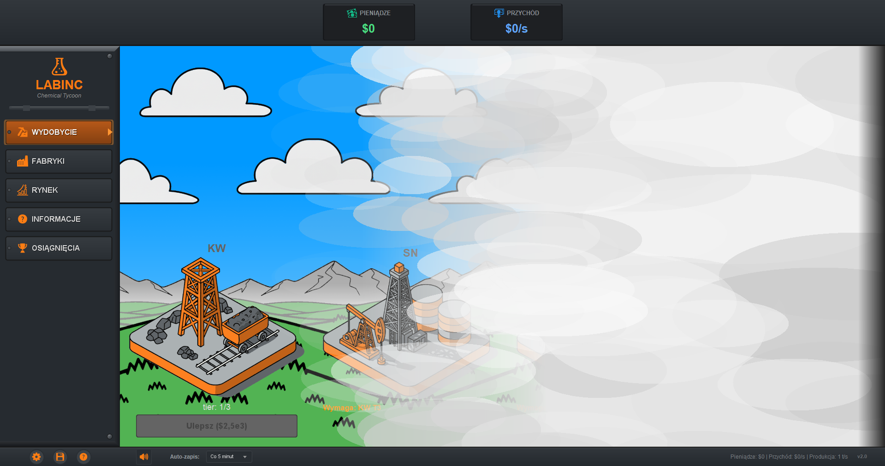

# LabInc: Chemical Tycoon

LabInc is a Java incremental game about building a chemical production network. The player starts with basic extraction, reinvests revenue in upgrades, and unlocks increasingly advanced factories and elements.



## Features

- 16 mines and factories with progressive unlock conditions
- Production and market systems for 118 chemical elements
- Upgrade tiers and production multipliers
- Achievements, settings, sound, and save/load support
- Java Swing interface with a custom dark visual style
- Resource data stored in JSON for easier balancing and extension

## Technology

- Java 8 or newer
- Java Swing
- Maven
- JNA for Windows integration
- Apache Batik for SVG rendering
- MP3SPI and JLayer for audio playback

## Build and run

Requirements:

- JDK 8 or newer
- Maven 3.6 or newer

Build an executable JAR:

```bash
mvn clean package
```

Run the packaged game:

```bash
java -jar target/labinc-game-1.0.0-jar-with-dependencies.jar
```

On Windows, `compile-and-run.bat` performs the Maven build and launch sequence. The older `run.bat` script also contains a direct compilation fallback, but Maven is the supported path because it includes external dependencies and resources.

## Project structure

- `src/main/java/com/labinc/` - application entry point, model, UI, and utility classes
- `src/main/resources/` - game data, icons, and sound assets
- `docs/` - architecture, game instructions, and implementation notes
- `pom.xml` - dependencies and executable JAR configuration

## Game data

Factories, elements, resources, and related values are defined in JSON files under `src/main/resources/`. When changing balance values, keep unlock conditions, production rates, prices, and achievement thresholds consistent.

## Documentation

Detailed documentation is available in:

- [Architecture](docs/ARCHITEKTURA.md)
- [Game instructions](docs/INSTRUKCJA_GRY.md)
- [Technical documentation](docs/DOKUMENTACJA.md)

The linked documents currently remain in Polish.

## License

No license has been granted for this repository unless a license file states otherwise. Third-party libraries and assets remain subject to their own licenses.
